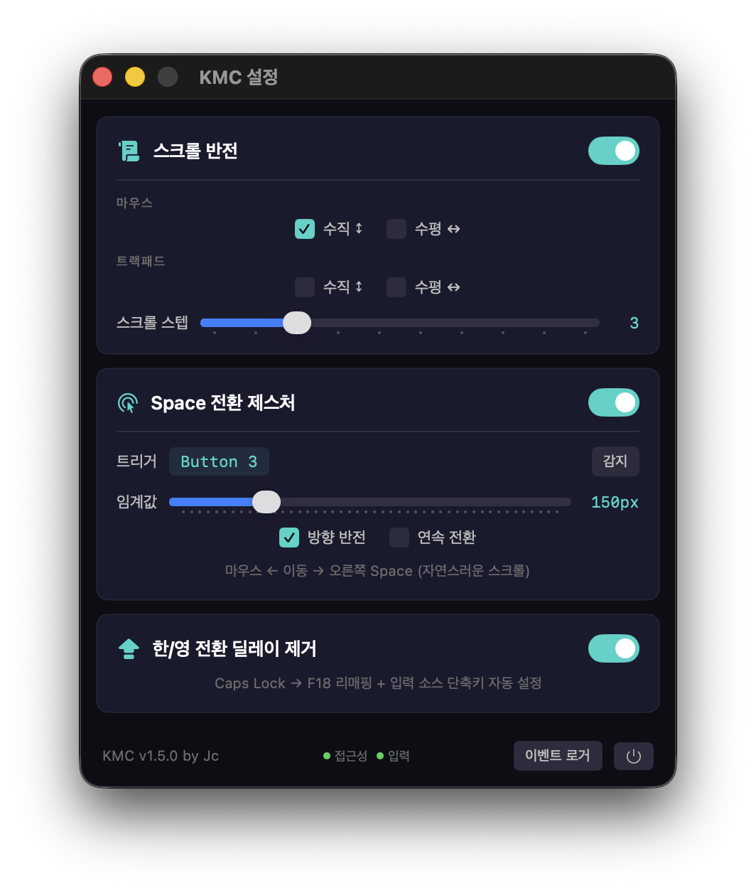

# KMC (Keyboard Mouse Control)

macOS menu bar utility that combines scroll reversal, mouse gesture-based Space switching, and Caps Lock delay removal in a single lightweight app.

> **Note:** 현재 UI는 한국어로 제공됩니다. This app is currently developed for Korean users.

<p align="center">
  
</p>

## Why?

Jc가 MacBook Pro에서 Logitech G309 게이밍 마우스를 사용하던 중 겪은 불편함에서 시작된 프로젝트입니다.

- G309는 게이밍 마우스라 Logi Options+를 지원하지 않아 **스크롤 방향 반전**을 자체 설정할 수 없었고,
- 트랙패드의 **전체 화면 앱 쓸어넘기기**를 마우스로 대체할 방법이 없었으며,
- macOS의 **Caps Lock 한/영 전환 딜레이**가 빠른 타이핑을 방해했습니다.

이 세 가지 문제를 해결하기 위해 별도 프로그램 3개를 설치하는 대신, 하나의 가벼운 메뉴바 앱으로 직접 만들었습니다.

## Features

### Scroll Reversal
- Independent mouse / trackpad reversal
- Vertical and horizontal axis control
- Adjustable scroll step multiplier
- Based on [Scroll Reverser](https://github.com/pilotmoon/Scroll-Reverser) (Apache 2.0)

### Space Switching Gesture
- Hold a configurable mouse button + move left/right to switch between fullscreen apps / Spaces
- Uses synthetic DockSwipe events for native macOS animation
- Adjustable movement threshold (50-500px)
- Direction inversion option (natural / standard)
- Continuous swipe support (multiple switches in a single hold)
- Works with any HID button including vendor-specific buttons (e.g., Logitech G309 DPI button)

### Caps Lock Delay Removal
- Eliminates the ~0.5s Caps Lock delay for Korean/English input switching
- Remaps Caps Lock → F18 via `hidutil` (bypasses all macOS Caps Lock special handling)
- Automatically sets F18 as the input source shortcut (no manual setup)
- Re-applied on app launch and wake from sleep

## Requirements

- macOS 13.5+
- Accessibility permission (for event taps)
- Input Monitoring permission (for HID device access)

## Build

No Xcode required. Uses Swift Package Manager:

```bash
bash build-app.sh
```

The built app will be at `build/KMC_v{VERSION}.app`.

## Install

1. Move `KMC_v{VERSION}.app` to `/Applications`
2. Launch the app (appears in menu bar)
3. Grant Accessibility and Input Monitoring permissions when prompted
4. Enable desired features via the settings window

## How It Works

| Feature | Mechanism |
|---------|-----------|
| Scroll Reversal | Dual CGEventTap (active for modification, passive for touch detection) |
| Space Switching | IOHIDManager (button detection) + CGEventTap (movement tracking) + synthetic DockSwipe events |
| Caps Lock Fix | `hidutil` UserKeyMapping + `defaults write` symbolic hotkeys |

## Credits

- Scroll reversal based on [Scroll Reverser](https://github.com/pilotmoon/Scroll-Reverser) by Nick Moore (Apache 2.0)
- DockSwipe event structure based on [Mac Mouse Fix](https://github.com/noah-nuebling/mac-mouse-fix) by Noah Nuebling

## License

Apache License 2.0 — see [LICENSE](LICENSE)

## Author

Jc
